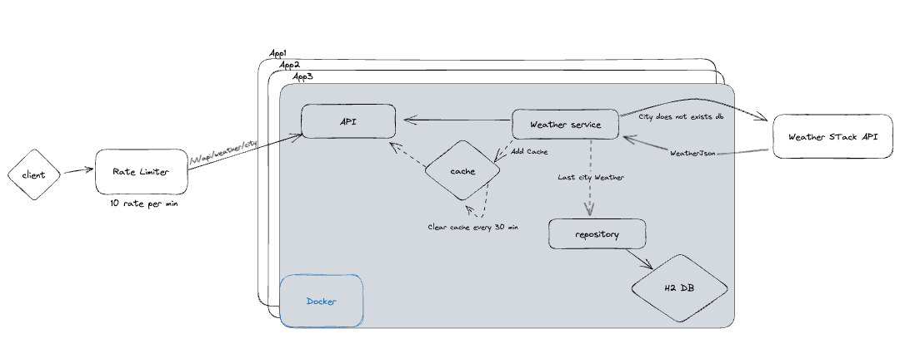

# Weather API

This project is a weather REST API designed with Spring Boot.

## Technologies used:
- Java 17
- Spring Boot 3.0
- Open API Documentation
- Spring Data JPA
- H2 In Memory Database
- Restful API
- Maven
- Docker
- Docker Compose
- Cache
- Rate Limiter
